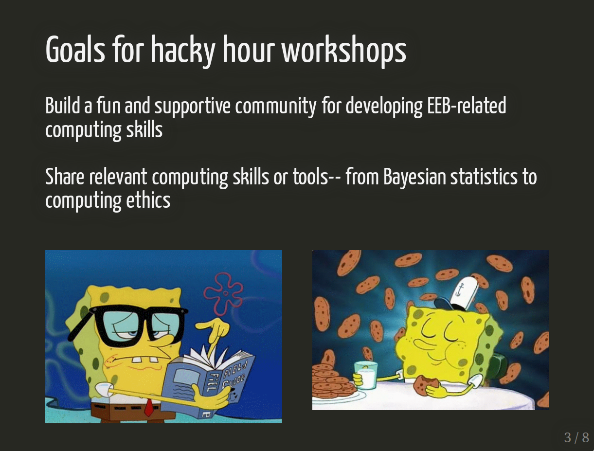
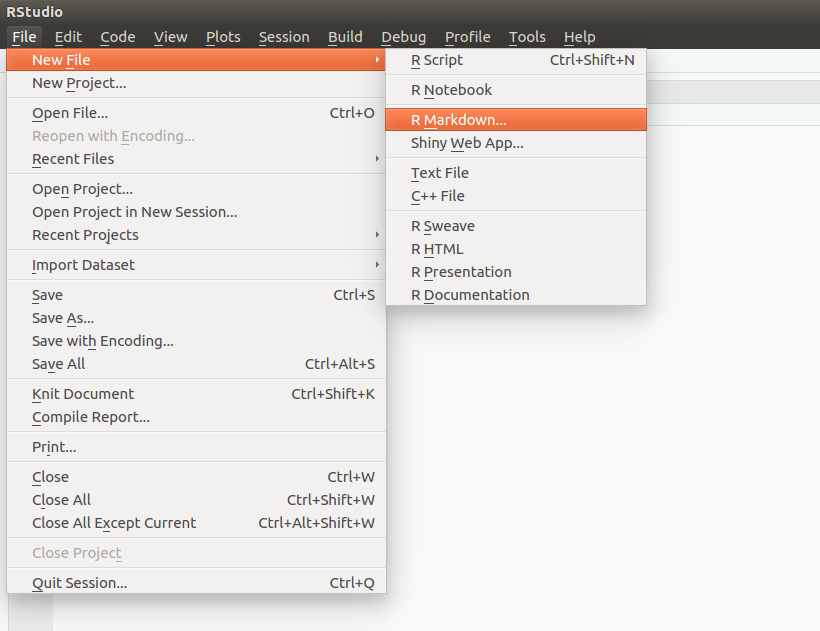
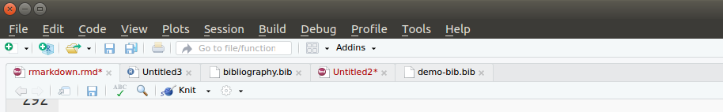
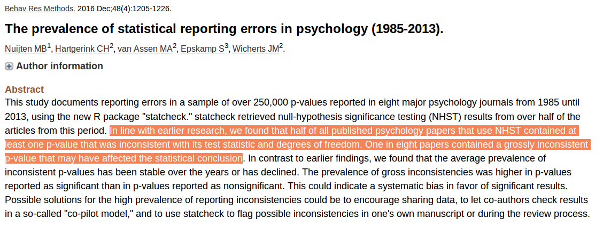

class: center, middle

```{css, echo=FALSE}
pre {
  background: #D3D3D3;
  max-width: 100%;
  max-height: 100%;
  overflow-x: auto;
  overflow-y: auto;

}
```


```{r set, include=FALSE}
options(htmltools.dir.version = FALSE)
```


# But first...

---
class: inverse

# Goals for hacky hour workshops

--

### Build a fun and supportive community for developing EEB-related computing skills

--

### Share relevant computing skills or tools-- from Bayesian statistics to computing ethics

--

.pull-left[

]

--
.pull-right[

]
---

class: 

```{r, echo = F}
icon::fa("clock", size = 3) 
```
--

.pull-left[


### Hour 1: Workshop/demos

*Tentative topics*<sup>1</sup>  
- **Writing with R Markdown**   
- Version control with Git/Github  
- Visualizing data in `R`  
- Working with "messy" data in `R`  
- Base R: Functions, Loops, and Conditionals  

*Future topics*
- Advanced statistics statistics  
- Spatial analyses
- ...   

<sup>1</sup>: Inspired by the [British Ecological Societies' Guide to Reproducible Code](https://www.britishecologicalsociety.org/wp-content/uploads/2017/12/guide-to-reproducible-code.pdf)

]

--

.pull-right[


### Hour 2: Open time for coworking


]

---

class: center, middle

background-image: url("https://bookdown.org/yihui/rmarkdown/images/hex-rmarkdown.png")
background-size: contain

---

## Markdown- a simple markup language

```
Markdown helps you generate documents with lots of **features** (section headers, figures, footnotes, ...) from simple, plain-text files.
```
Markdown helps you generate documents with lots of **features** (section headers, figures, footnotes, ...) from simple, plain-text files.

<hr>

--

```
Here's some *italicized text*
```
Here's some *italicized text*
<hr>

--

```
### Here's a subsection heading
```

### Here's a subsection heading

<hr>

--

```
[Here's a link to the UCLA EEB Website](https://www.eeb.ucla.edu/)
```
[Here's a link to the UCLA EEB Website](https://www.eeb.ucla.edu/)

.pull-right[
[Check out this helpful cheatsheet for more options](https://www.markdownguide.org/cheat-sheet)
]

---

class: center,middle


---

class: center, middle

# R Markdown allows you to embed R code in markdown documents, promoting tight integration of analyses and writing

---

class: center, middle

# R Markdown allows you to embed R code in markdown documents, promoting tight integration of analyses and ~~writing~~ thinking

---

class: center

background-image: url("https://d33wubrfki0l68.cloudfront.net/c6964e233a57962f8bda1dd3e5b497a71218a9f6/9c068/lesson-images/how-3-output.png")
background-size: contain

---
class: center

background-image: url("rmarkdown-compilation.svg")
background-size: contain

---

class: center,middle

## RMarkdown is a powerful tool

---
background-image: url("rmd-homework.png")
background-size: contain

### RMarkdown for assignments

---
background-image: url("rmd-analysis-notebook.png")
background-size: contain

### RMarkdown for lab notebooks


---

### RMarkdown for Rmarkdown workshops `r emo::ji("thinking")`


.pull-left[
```
class: inverse

# Goals for hacky hour workshops

--

### Build a fun and supportive community for developing EEB-related computing skills

### Share relevant computing skills or tools-- from Bayesian statistics to computing ethics

--

.pull-left[

]

--
.pull-right[

]
---


```
]


.pull-right[

]
---

background-image: url("https://media1.tenor.com/images/b9312e397f43932bc50b2ec584d4ea42/tenor.gif?itemid=3835785")
class: inverse
---

## Getting started

1. Open RStudio and install the `rmarkdown` package
```{r, eval = F}
* install.packages("rmarkdown")
```

--

2. Create a new R Markdown file



---

## Parts of an R Markdown document

### 1. YAML head
```
---
title: "My First RMarkdown Document"
author: "Gaurav Kandlikar"
date: "October 26, 2018"
output: html_document
---
```

<hr> 

--

### 2. R Code chunk
  
  ```{r setup, eval = F}
  knitr::opts_chunk$set(echo = TRUE)
  ```

---

### 3. Markdown text

```
## R Markdown

This is an R Markdown document. Markdown is a simple formatting syntax for authoring HTML, PDF, and MS Word documents. For more details on using R Markdown see <http://rmarkdown.rstudio.com>.

When you click the **Knit** button a document will be generated that includes both content as well as the output of any embedded R code chunks within the document. You can embed an R code chunk like this:
```

<hr>

--

### 4. "Knit" document



--


---

background-image: url("https://bookdown.org/yihui/rmarkdown/images/cover.png")
background-size: contain

---

### Embedding $\LaTeX$ in RMarkdown documents


Markdown gets you 90% of the way there. 

--

$\LaTeX$ can do the rest.   

--

- Latex can help typset equations

```
$$\frac{\mathrm{d}N_i}{\mathrm{d}t} =  
        r_i N_i\left(1-\frac{K_i-N_i}{K_i}\right)$$
```

$$\frac{\mathrm{d}N_i}{\mathrm{d}t} = r_i N_i\left(1-\frac{K_i-N_i}{K_i}\right)$$


--

- or manage bibliographies

```
Coexistence theory is fun! [@Chesson_2000]
```

Coexistence theory is fun! (Chesson 2000)

---

class: center, middle, inverse

## Writing documents in RMarkdown isn't trivial...
--

### But it's worth learning.

---

class: center, middle

# Three key features of RMarkdown for scientific writing
--

### 1. "In-line" R code
### 2. Reference Management
### 3. Custom Word templates

---
## Key feature 1. In-line R code 

Consider a sentence like 

> We found a strong correlation between panda size and bamboo demand (R = .85, p = 0.002).

How did it get to be?  

--

```
We found a strong correlation between panda size and bamboo demand (R = .85, p = 0.002).
```

--

### Let's take a closer look at the underlying analysis.

---

> We found a strong correlation between panda size and bamboo demand (R = .85).


```{r, echo = F}
dat <- MASS::mvrnorm(50, mu = c(0,0), Sigma = matrix(c(1,.815,.812,1), ncol = 2),
               empirical = TRUE)
colnames(dat) = c("Mass", "Bamboo")
dat <- data.frame(dat)
knitr::kable(head(dat, n = 4), "html")
```
  
--

```{r, highlight.output=c(11)}
mass_bamboo_corr <- cor.test(dat$Mass, dat$Bamboo); mass_bamboo_corr
```

---



---

### Use "in-line R code" to avoid such errors 

--

  ```
  We found a strong correlation between panda size and bamboo demand 
  (R = ` r mass_bamboo_corr$estimate `).
  ```
--

We found a strong correlation between panda size and bamboo demand (R = `r mass_bamboo_corr$estimate`).


--

<hr>

## Not just for avoiding errors!

---

## Key feature 1. Reference management

Three-steps to managing references in RMarkdown:  

--

1. Add a `bibliography` file to the YAML chunk  

--

2. Populate the bibliography file with your references  

--

3. Add in-line citations using `@Reference_tag`  

---

## Key feature 3. Word templates


Three steps to tolerable .Docx files:  

--

1. Write your RMarkdown file exactly as you would for generating HTML or PDF outputs

--

2. Add a reference to a custom Word template to the YAML header: 

```
output:
    word_document:
      reference_docx: word_template.docx
```

--

3. Customize the Word template to fit your needs. 

*Note*: This can be a little tricky. Check out [this resource](https://stackoverflow.com/questions/29440007/changing-word-template-for-knitr-in-rmarkdown) by the author of the Knitr package.

---

class: inverse

