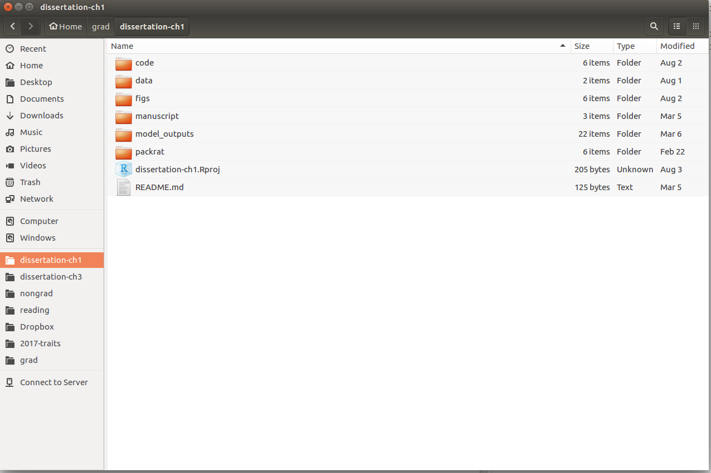

class: center

```{r setup, include=FALSE}
options(htmltools.dir.version = FALSE)
```


```{css, echo=FALSE}
pre {
  background: #D3D3D3;
  max-width: 100%;
  max-height: 100%;
  overflow-x: scroll;
  overflow-y: auto;

}
```


##  Normal project workflow

---

## Two reasons for a standardized project workflow

--

### 1. Research reproducibility `r emo::ji("repeat")`

--
### 2. Easier collaborations `r emo::ji("fist_right")` `r emo::ji("fist_left")`


---

## 1. Research reproducibility `r emo::ji("repeat")`

```{r, echo = F, out.height="200px"}
knitr::include_graphics("borregaard-hart.png")
```

--

> Ecology faces particular challenges in reproducibility because  data  collection  is  often  context  dependent,  and  because  **there  are  few  established  standards  for storing metadata and facilitating study replication**.

--

> The keys to a greater level of reproducibility in ecology are  to establish analytical protocols that are **robust and transparent**, to **faithfully document the analytical process including any failed attempts**, and to ensure that the **storage and acquisition of data is documented and includes the appropriate metadata**.
---

## 2. Easier collaborations  `r emo::ji("fist_right")` `r emo::ji("fist_left")`

--

### Collaborations without standardized project workflows... 


#### Emailing documents back and forth

```
Hi all,

Attached is the script to do the ancestral trait reconstruction 
on beak size. I'm also attaching the data file in case it's
easier for you to read this in. 

```

--

#### "I can't find the file you are working on"

```{r, eval = F}
setwd("~/Documents/grad school/ElephantPoopProject/poop_masses.csv")
```


---
class:inverse, middle, center 

## If these problems<sup>*</sup> sound familiar...

--

### Your life will be improved with a better project workflow

.pull-right[<sup>*</sup> or similar]

---
class: inverse, middle
## The basics: One project, One directory


