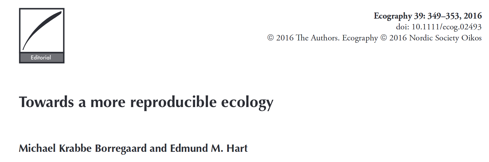
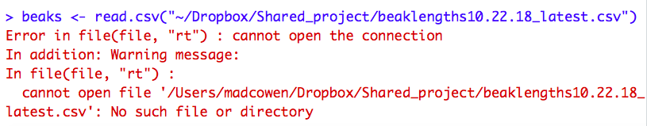
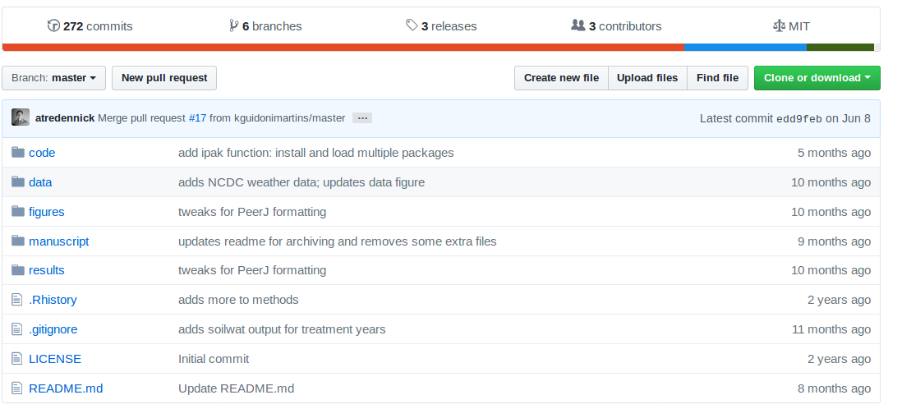
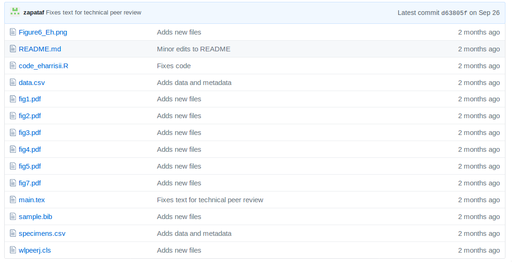
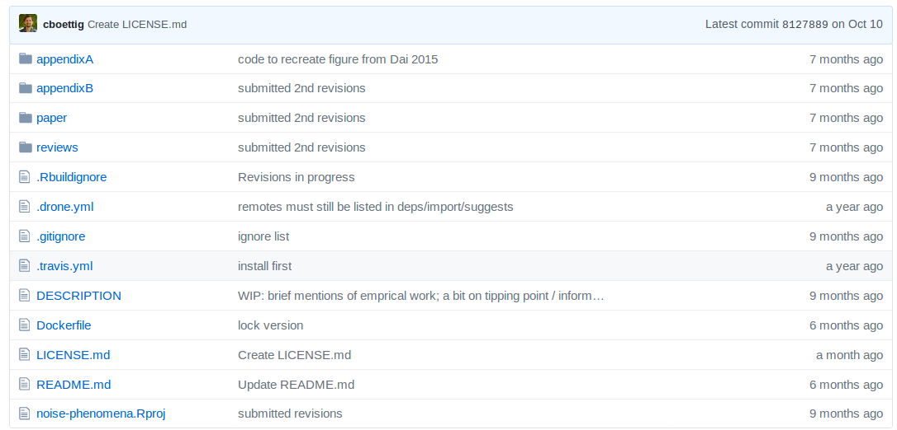
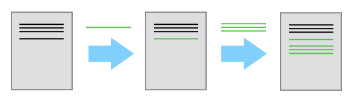
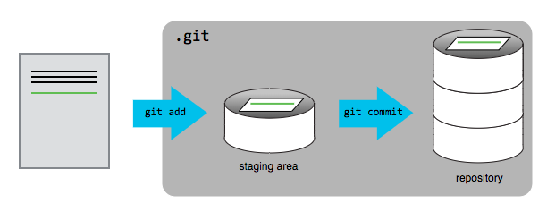
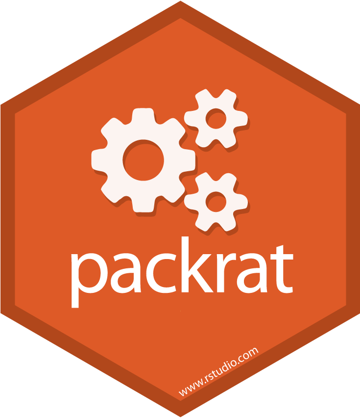

class: center, middle
```{r setup, include=FALSE}
options(htmltools.dir.version = FALSE)
library(emo)
```


```{css, echo=FALSE}
pre {
  background: #D3D3D3;
  max-width: 100%;
  max-height: 100%;
  overflow-x: scroll;
  overflow-y: auto;

}
```


##  Project workflow

--
### Sequence between all stages of a project from conceptualization to completion

---

## Two reasons for a standardized project workflow

--

### 1. Research reproducibility `r ji("repeat")`

--
### 2. Easier collaborations `r ji("fist_right")` `r ji("fist_left")`


---

## 1. Research reproducibility `r ji("repeat")`

```{r, echo = F, out.height="200px"}

```

--

- Ecology faces particular challenges in reproducibility because  data  collection  is  often  context  dependent,  and  because  **there  are  few  established  standards  for storing metadata and facilitating study replication**.

--

- The keys to a greater level of reproducibility in ecology are  to establish analytical protocols that are **robust and transparent**, to **faithfully document the analytical process including any failed attempts**, and to ensure that the **storage and acquisition of data is documented and includes the appropriate metadata**.
---

## 2. Easier collaborations  `r ji("fist_right")` `r ji("fist_left")`

--

### Collaborations without standardized project workflows... 

--
#### Emailing documents back and forth

```
Hi all,

Attached is the script to do the ancestral trait reconstruction 
on beak size. I'm also attaching the data file in case it's
easier for you to read this in. 

```

--

#### "I think you forgot to send me beaklengths10.22.18_latest.csv"

--

#### "I can't find the file you are working on"

--

 

---
class:inverse, middle, center 

## If these problems sound familiar...

### Your life will be improved with a better project workflow

---
class: inverse

## Simple rules for better workflows 

--
### 1. One project, one directory  `r ji("open_file_folder")`  (`r ji("house")`)

--
#### Within this directory, use *relative paths*

--
### 2. Clear organization of data, scripts, output, summaries, figures/tables &nbsp;&nbsp;&nbsp; `r ji("zero")` `r ji("right_arrow")` `r ji("one")` `r ji("right_arrow")` `r ji("two")`

--
### 3. Workflow backups `r ji("globe")`

--

*Bonus: Version control*
 

---
class: inverse

## Quick aside

#### Directory = folder `r ji("open_file_folder")` 
  
--
  
#### A file's *path* tells us the string of folders we must go through to find a file `r ji("open_file_folder")` `r ji("right_arrow")` `r ji("open_file_folder")` `r ji("right_arrow")` `r ji("page_with_curl")`

--
```{r, eval = F}
read.csv("~/Desktop/gradschool/ElephantPoopProject/poop_masses.csv")
```

--
```{r, eval = F}
read.csv("~/Desktop/gradschool/ElephantPoopProject/eleph_moods.csv")
```
```{r, eval = F}
write.csv("~/Desktop/gradschool/ElephantPoopProject/poops-by-mood.csv")
```
--

#### Or

```{r, eval = F}
setwd("~/Desktop/gradschool/ElephantPoopProject/")
```
```{r, eval = F}
read.csv("poop_masses.csv")
```
---
class: inverse

## RProjects in RStudio make it easy to have clean workflows

--

### What an RProject does:  

#### 1. Creates a file with a .RProj suffix in a directory of your choice

#### 2. When you open this file in RStudio, it opens a new session of RStudio with the working directory set to where the .RProj file lives

#### 3. Everything associated with the project should live within this directory  

#### 4. When working on documents in the project, only need to use relative paths  

---
class: center,middle 

# Let's make a project!

---

## Recommended project organization  

```
my_project
  |- data
  | |- README.txt
  | |- raw-data-files
  | |- cleaned-data-files
  |- code
  | |- README.txt
  | |- 01-clean-raw-data
  | |- 02-run-pairwise-models
  | |- 03-run-multivariate-models
  | |- 04-generate-supplemental-tables
  | |- ...
  |- figures
  | |- ....
  |- tables
  | |- ...
  |- doc
  | |- project-notes.Rmd
  | |- manuscript.Rmd
  | |- ...
  |- ...
```

---
class:inverse  

## Real-life examples

#### 1. [Directory for](https://github.com/atredennick/usses_water) for Tredennick et al. "Ecosystem functional response across precipitation extremes in a sagebrush steppe" 

 

---
class:inverse  

## Real-life examples

#### 2. [Directory for](https://github.com/zapataf/ms_eharrisii) for Zapata & Villarroel "A new species of Escallonia (Escalloniaceae) from the inter-Andean tropical dry forests of Bolivia" 

 

---
class:inverse  

## Real-life examples

#### 3. [Directory for](https://github.com/cboettig/noise-phenomena) for Boettiger "Noise-driven phenomena in population biology " 

 

---

## Value of RProjects

- 80% of the benefits from 20% of the work  

- you're already putting files somewhere, so take a few seconds to do so in a way that gives you tremendous benefits  

- you can send your RProject to a collaborator and it doesn't matter where they store the directory; they won't need to change any file paths if it's all self-contained  

- new session = new environment  

- project philosophy = everything belonging to one project is all in one place  
- logical connection to git  

---
class: inverse, center

## Version control

```{r, out.height="540px", out.width="450px", echo = F}
knitr::include_graphics("phd-comics-final.gif")

```

---
class: inverse

## Git (images from Software Carpentry)



--



---

## Using Git in RProjects

### Go to https://github.com/UCLA-hacky-hours/demo-rproject and click on "Clone or download" to download a zipped RProject

--

#### - add comment to the script that says "updated by [your name]"
#### - change some variables, colors, and/or labels in the plot and generate an updated figure
#### - commit your changes with git

---

## Advanced features Part 1: GitHub

---

## Advanced features Part 2: better package management (with packrat)
```{r, out.height="400px", out.width="400px", echo = F}


```
---

## Advanced features Part 3: packages

---

## Workflow summary:

### 1. Generate an RProject with directories for data, analyses, and summaries  

### 2. Set up git and a back-up system (e.g., Dropbox, GitHub)

### 3. Write well-commented R scripts that clean the data and create output  

### 4. Write summaries with RMarkdown! Or at least store output in the project  
